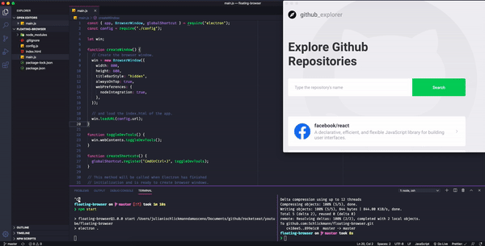

<h1 align="center">Floating Browser</h1>

<h3 align="center">Keep your favourite window on top of the others 🚀</h3>

  

  

  

  

  

  <a href="#rocket-Technologies">Technologies</a>&nbsp;&nbsp;&nbsp;|&nbsp;&nbsp;&nbsp;
  <a href="#-project">Project</a>&nbsp;&nbsp;&nbsp;|&nbsp;&nbsp;&nbsp;

 

## :rocket: Technologies

This project was developed with the following technology:

- [Electron](https://www.electronjs.org/)

## 💻 Project

## ✌🏻 How to use

- Clone the repository or download it;
- Under the project's root folder
  - run **npm install**;
  - change the **config.js** file to point at your preferred URL;
  - and run **npm start**;

---

  Made with ♥ by Juliani Schlickmann :wave: [Get in touch!](https://www.linkedin.com/in/juliani-schlickmann-damasceno/)
